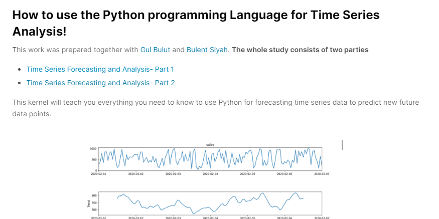

# My Studies on Kaggle
It is the repo I listed my kernels in Kaggle. You can access it in detail from my Kaggle address https://www.kaggle.com/bulentsiyah. (updated:13/06/2020)

## Time Series Forecasting and Analysis
<kbd>
  
</kbd>

https://www.kaggle.com/bulentsiyah/time-series-forecasting-and-analysis-part-2

### Content
* Deep Learning for Time Series Forecasting - (RNN)
* Multivariate Time Series with RNN
* Use Facebook's Prophet Library for forecasting

## License
MIT